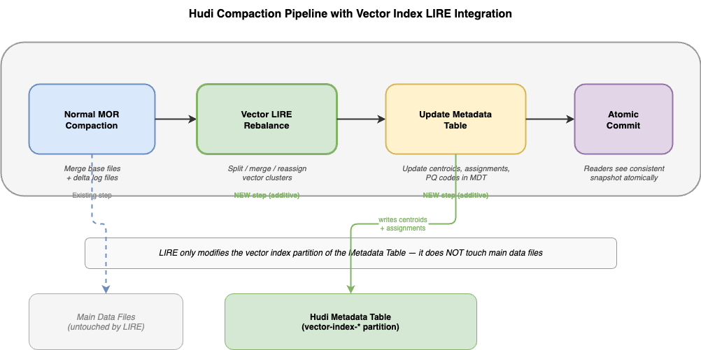

<!--
  Licensed to the Apache Software Foundation (ASF) under one or more
  contributor license agreements.  See the NOTICE file distributed with
  this work for additional information regarding copyright ownership.
  The ASF licenses this file to You under the Apache License, Version 2.0
  (the "License"); you may not use this file except in compliance with
  the License.  You may obtain a copy of the License at

       http://www.apache.org/licenses/LICENSE-2.0

  Unless required by applicable law or agreed to in writing, software
  distributed under the License is distributed on an "AS IS" BASIS,
  WITHOUT WARRANTIES OR CONDITIONS OF ANY KIND, either express or implied.
  See the License for the specific language governing permissions and
  limitations under the License.
-->

# RFC-104 Supporting Document: Bootstrap and Maintenance

## Scope

This document covers vector index lifecycle work that is not part of the steady-state
read path or write path:

- index scheduling
- bootstrap
- rebuild
- compaction/rebalancing
- cleaner and generation lifecycle

## Index Scheduling

Vector index creation reuses Hudi's metadata index scheduling flow.

Current POC implementation:

- `HoodieSparkIndexClient#createVectorIndex`
- `ScheduleIndexActionExecutor#resolvePartitionName`
- `HoodieBackedTableMetadataWriter` vector index initialization path

The scheduler registers the dynamic metadata partition (`vector_index_<name>`) and schedules
an index action against a completed data timeline instant.

## Bootstrap Flow


Bootstrap creates the first complete vector index generation:

1. Read latest base files from the data table.
2. Extract record key, partition path, file name, and source vector column.
3. Convert `VECTOR` values into Spark ML vectors.
4. Train IVF centroids with KMeans.
5. Assign each record to a centroid.
6. Compute file-group mappings and cluster populations.
7. Derive shard counts per cluster.
8. Encode each vector with `RaBitQEncoder`.
9. Write MDT records:
   - `__centroids__`
   - `__quantizer__`
   - `__manifest__`
   - `M|<generation>`
   - `C|<generation>|<cluster>`
   - `A|<record_key>`
   - `P|<generation>|<cluster>|<shard>|<record_key>`
   - `__fg__/<cluster>/<partition_path>` while the current pruning POC needs it

Current POC implementation:

- `SparkHoodieBackedTableMetadataWriter#getVectorIndexRecords`
- `buildQuantizerRecord`
- `buildManifestRecord`
- `buildGenerationManifestRecord`
- `buildClusterManifestRecords`
- `buildPostingRecords`
- `buildFgMappingRecords`

## Generation Model

RaBitQ metadata is part of the generation contract. Each generation records the quantizer type, packed code width, random seed, and `assume_normalized` flag so readers can decode and score postings without consulting base table schema changes.

Posting rows are generation-scoped. A generation can be rebuilt independently and activated
by updating `__manifest__`.

```text
__manifest__         -> active generation id
M|0000007B           -> immutable generation metadata
C|0000007B|0000000A  -> cluster metadata
P|0000007B|...       -> posting rows for that generation
```

This keeps readers from mixing posting rows across rebuilds.

## Rebuild

`REFRESH INDEX` or a future rebuild operation creates a new generation from the latest table
snapshot, then atomically publishes that generation through `__manifest__`.

Old generations remain readable until cleaner policy permits removal.

## Compaction and Rebalancing




LIRE-style rebalancing is treated as metadata lifecycle work, not as part of the steady
read or write path.

The maintenance job may:

- recompute cluster populations
- detect cluster imbalance
- split or merge clusters
- reassign boundary vectors
- publish a new generation

Because postings and assignments live in MDT, this work does not require hidden-column
rewrites in base table files.

## Cleaner Coordination

The metadata cleaner must retain vector generations long enough for valid table snapshots
to find matching metadata. This is the same broad invariant Hudi already needs for other
metadata indexes: metadata retention cannot be shorter than the table snapshots it serves.

## Open Work

- finalize incremental update behavior for posting rows during normal writes
- decide whether LIRE publishes partial updates or always publishes a full generation
- add validation tooling to compare MDT postings against base table vectors
- remove hidden-column materialization paths after MDT-only read integration is complete
